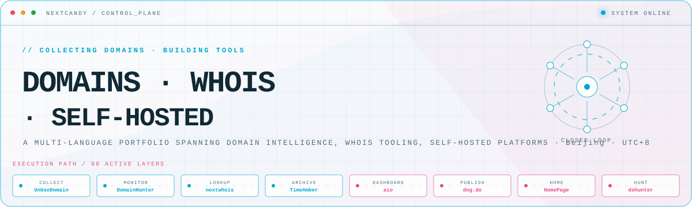

<picture>
  <source media="(prefers-color-scheme: dark)" srcset="assets/hero-dark.svg">
  <source media="(prefers-color-scheme: light)" srcset="assets/hero-light.svg">
  
</picture>

<picture>
  <source media="(prefers-color-scheme: dark)" srcset="assets/dashboard-dark.svg">
  <source media="(prefers-color-scheme: light)" srcset="assets/dashboard-light.svg">
  
</picture>

<picture>
  <source media="(prefers-color-scheme: dark)" srcset="assets/closed-loop-dark.svg">
  <source media="(prefers-color-scheme: light)" srcset="assets/closed-loop-light.svg">
  
</picture>

## ◉ Systems online

| Node | Mission | Runtime |
| --- | --- | --- |
| [`UnUseDomain`](https://github.com/NextCandy/UnUseDomain) | **PORTFOLIO** · 闲置域名展示米表 | TypeScript · UnUseDomain.com |
| [`DomainHunter`](https://github.com/NextCandy/DomainHunter) | **MONITOR** · RDAP-first domain monitoring with safe availability detection | Go · RDAP · availability check |
| [`TimeAmber`](https://github.com/NextCandy/TimeAmber) | **SELF-HOSTED** · Blog, web archive and content platform for NAS | TanStack Start · Supabase · TypeScript |
| [`nextwhois`](https://github.com/NextCandy/nextwhois) | **LOOKUP** · Modern Whois lookup tooling | TypeScript · Next.js |
| [`aio`](https://github.com/NextCandy/aio) | **DASHBOARD** · Domain portfolio live board | dog.do data · nextwhois live lookup |
| [`dog.do`](https://github.com/NextCandy/dog.do) | **PUBLISH** · 🐶 Dog.Do 域名站点 | CSS · domain landing |

## ▣ Module registry

<strong>Domain intelligence</strong> · 4 source repositories

| Module | Signal |
| --- | --- |
| [`DomainHunter`](https://github.com/NextCandy/DomainHunter) | RDAP-first 域名监控与安全可注册性检测。 |
| [`nextwhois`](https://github.com/NextCandy/nextwhois) | 现代化 Whois 查询工具。 |
| [`whoisnext`](https://github.com/NextCandy/whoisnext) | Whois 查询链路实验。 |
| [`dshunter`](https://github.com/NextCandy/dshunter) | 域名发现与嗅探工具。 |

<strong>Portfolio &amp; 米表</strong> · 4 source repositories

| Module | Signal |
| --- | --- |
| [`UnUseDomain`](https://github.com/NextCandy/UnUseDomain) | 闲置域名展示米表 · UnUseDomain.com。 |
| [`aio`](https://github.com/NextCandy/aio) | 域名组合仪表盘，接入 dog.do 数据与 nextwhois 实时查询。 |
| [`DomainName`](https://github.com/NextCandy/DomainName) | 域名数据处理脚本集合。 |
| [`dog.do`](https://github.com/NextCandy/dog.do) | 🐶 Dog.Do 域名落地页。 |

<strong>Content &amp; self-hosted</strong> · 4 source repositories

| Module | Signal |
| --- | --- |
| [`TimeAmber`](https://github.com/NextCandy/TimeAmber) | 面向 NAS 的自托管博客、网页归档与内容管理平台。 |
| [`MeArchive`](https://github.com/NextCandy/MeArchive) | 个人内容归档系统。 |
| [`content-animator`](https://github.com/NextCandy/content-animator) | 内容动效与展示实验。 |
| [`HomePage`](https://github.com/NextCandy/HomePage) | 个人主页。 |

<strong>Lab</strong> · 4 source repositories

| Module | Signal |
| --- | --- |
| [`who`](https://github.com/NextCandy/who) | Whois 接口实验。 |
| [`dh`](https://github.com/NextCandy/dh) | 域名工具链原型。 |
| [`allinone`](https://github.com/NextCandy/allinone) | 一体化服务整合实验。 |
| [`DOM`](https://github.com/NextCandy/DOM) | 前端 DOM 操作实验。 |

<a href="https://github.com/NextCandy">GitHub</a> · <a href="https://UnUseDomain.com">UnUseDomain</a> · <a href="https://wanmi.org">wanmi.org</a> · <a href="https://twitter.com/iWangGang">X / Twitter</a>

<!-- Live dashboard data is generated by scripts/update_dashboard.py. -->
